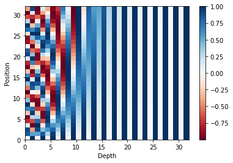
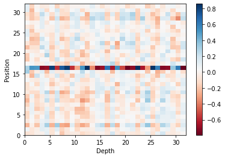

## Relative Positional Encoding

This repository contains a implementation code of [Self-Attention with Relative Position Representations](https://arxiv.org/pdf/1803.02155.pdf).

Relative positional encoding considers pairwise relationships between tokens in the sentence, which enables to model relative distance of tokens. Usually, relative positional encoding is added to the key and value in the form of learnable parameters within the self-attention module.

## Prerequisites

- Tensorflow 2.7.0

## Usage

    # Train
    $ python train.py --is_relative 0 # absolute positional encoding
    $ python train.py --is_relative 1 # relative positional encoding

	# Evaluation
	$ python eval.py --is_relative 0
    $ python eval.py --is_relative 1

## Absolute vs Relative Positional Encoding

- Sequence length: 32, Embedding dimensoin: 32

Absolute            |  Relative
:-------------------------:|:-------------------------:
  |  

## Results

	Input: 고민이 있어
    absolute: 마음을 더 열어보세요.
    relative: 생각을 해보세요.

    Input: 너무 화가나
    absolute: 지금 연락해 보세요.
    relative: 자신을 비난하지 마세요.
